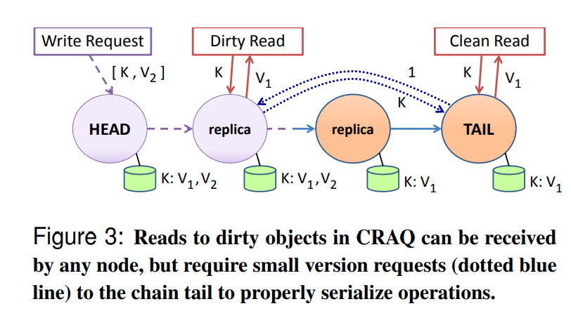

# Object Storage on CRAQ

## paper

[paper](https://pdos.csail.mit.edu/6.824/papers/craq.pdf)

## Abstract

一种基本的链式复制模型，一个对象存储的服务器用链式形式来组织，链头负责写入，链尾负责读取。如果读取都是在一个服务器上的话，那么这个服务器会成为一个热点服务器，通过多链式均衡对象的读取和写入在服务器上的分布，能做到负载均衡。但是，这种设计在跨数据中心的实现，会造成客户端访问只能访问到远端数据中心的数据。

这篇论文描述了一个关于CRAQ(Chain Replication with Apportioned Queries)的设计和实现，主要贡献了以下几点：

* CRAQ在强一致性下允许所有的节点进行读操作，因此支持所有节点上的负载均衡。
* CRAQ的设计天然的支持低延迟下的最终一致性读，而且能够指定最大读取过时时间。
* 描述了一种构建大范围，跨数据中心的负载均衡机制来构建CRAQ链。

## Basic System Model

### Interface and Consistency Model

接口：

* write(objId, V)

* V <- read(objId)

基本保证：

* 强一致性 保证强一致性，读写串行化，读取能读到最后一次写入的值

* 支持最终一致性读，在指定时间段内，比如广播复制消息到下游节点但是各个节点没有完全接受时，客户端可以通过配置来做到最终一致性读取。

### Chain Replication

链式复制，指定长度C的服务器节点组织成链式，从链的头部写入，读取只从链的尾部读取。写入时，复制消息随着链头到链尾的顺序进行广播，直到尾部接受了写入，沿着反方向ack，写入才算成功。

### Chain Replication with Apportioned Queries

相比于CR，CRAQ支持在所有节点上进行读取。通过以下方式来进行支持：

1. 每个节点存储每个对象的多版本数据，版本号单调递增，每个版本数据被标记为脏数据或者干净数据。

2. 当某个节点接收到写入请求时，分情况处理。

    * 假如它不是尾节点，接受该版本号的数据，标记为脏数据，把消息广播到它的Successor(即后继节点)。

    * 假如它是尾节点，把这个数据标记为干净的，我们称之为这个数据被提交了。尾节点可以反方向广播ack消息。
3. 当前置节点收到ack消息，可以把自己节点数据标记为clean，然后删除之前的版本。

4. 当某个节点接收到读取请求：

    * 如果当前最后一个版本的数据状态是干净的，直接返回

    * 如果不是，该节点需要向尾节点发送一个查询该数据在尾节点最后一个已提交的数据版本号，该节点把节点的该版本的数据标记为clean并返回。可能当时这个版本并没有ack给客户端，但是这也不影响强一致性的保证，系统的强一致性顺序依赖于尾节点的顺序。

### Consistency Models on CRAQ

craq的读取支持多种一致性模型：

* 强一致性
* 最终一致性，读取可以直接返回最后一个clean版本的数据，而不是去查询尾节点确认
* Eventual Consistency with Maximum-Bounded Inconsistency，节点可以返回需要指定时间点或者版本号的最大版本的数据。

## Scaling CRAQ

多数据中心的CRAQ，可以选择在每个数据中心组织独立的CRAQ链条，每个数据中心的链尾连接下一个数据中心的链头，链头连着上一个数据中心的链尾。在一个数据中心里面，可以通过动态哈希来把键划分属于不同的链条，然后小心的把不同链条的头尾节点均匀的分布在不同的服务器上来均衡负载。还可以使用更复杂的方法，这个取决于协调服务。

craq使用zookeeper作为协调服务。

## Extensions

### Mini-Transactions on CRAQ

#### Single-Key Operations

单键操作：

* Prepend/Append: 在对象头尾追加值

* Increment/Decrement: 把对象视为数值，增加或者减少值

* Test-and-Set: 以指定版本号来进行cas

前两个操作可以在头节点进行，且是直接在最后版本号上进行，不管这个版本是不是已经提交了，然后广播一个完整的操作值。

cas操作可以先简单的检查一下最后提交的版本号是不是符合指定版本号，如果是的话，进行替换操作，如果不是，拒绝请求，客户端可以在被拒绝后选择是否降低版本继续。

#### Single-Chain Operations

一个事务上的操作无非就是比较，读取，写入操作集，如果事务的所有键是同一个链条上的，也就是说他们的写入全部都在头节点上，那么这样一个两阶段提交就降级为单节点上的操作，craq可以选择在单节点上加锁，直到所有更改广播到尾节点并提交。

#### Multi-Chain Operations

多个链条上的事务，可以在各个链条头上对事务涉及到的键进行加锁操作，直到事务完全的提交。

### Lowering Write Latency with Multicast

复制传播可以采用多播，只要保证尾节点在接受复制操作前，链条上其它节点已经接受了这个操作。同样的，尾部节点可以多播ack消息而不是逐次回路追溯到上游。

## Management and Implementation

### Chain Node Functionality

### Failure Recovery
