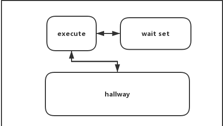
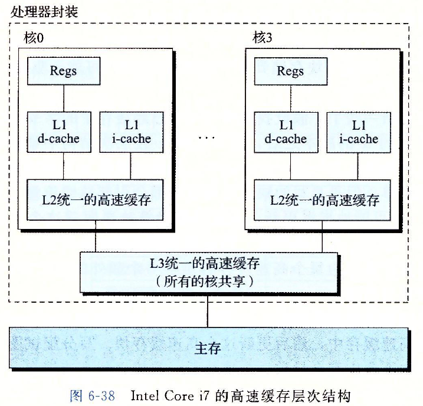

# java多线程编程

## Thread

java的线程是会映射到操作系统的进程或者线程上，一般来说，和操作系统的映射是1：1的，比如在unix上面，一个java线程会映射到一个操作系统的轻量级进程上面，在一些特殊的操作系统上，比如soloris，会m:n映射(n + m > 2)。

从java线程的实现上来说，由于是映射到操作系统的进程上面，大部分行为和操作系统级的进程或者线程有很大的相似之处。毕竟java规范中的线程是高级包装，许多行为和操作系统级的并不相同，这里面有很多微妙之处。java中用`java.lang.Thread`类来作为线程的抽象，我们可以从这个类出发来了解java的线程。

```java
new Thread(Runnable target);

public synchronized void start();
```

Thread的构造方法可以很简单，仅提供一个`Runnable`接口，`Runnable`是这样一个接口，里面只有一个`run()`方法，这个方法没有参数没有返回结果，代表一段执行过程。调用start方法时，构造一个线程并执行target对象的`run()`方法，当target正常执行完了，Thread也就宣告结束并销毁。`start()`不能执行多次。

### Thread的属性

线程不仅仅只有一个Runnable的target对象，还有其它一些属性，我们可以它的完整的构造函数签名和set方法入手：

```java
new Thread(ThreadGroup group, Runnable target, String name,long stackSize);

public final void setDaemon(boolean on);
public final void setPriority(int newPriority);
public void setContextClassLoader(ClassLoader cl);
public final synchronized void setName(String name);
```

* name，一个线程的名称可以在构造时指定，也可以在运行时更改，这个名称能让我们在查看栈日志的时候更好的排查问题。

* group，线程组的存在是为了更好的进行安全控制，用户可以开启安全管理器来限制线程只能对组内它线程执行一些特定的方法，比如`suspend()`、`stop()`等方法。

* stackSize，栈的大小，默认情况下虚拟机会给一个线程1M的栈大小，这个参数可以由用户来进行指定。栈如果足够大，能支持更多的递归调用，栈如果足够小，能支持更多的并发线程。这个属性是个建议值，实际效果取决于虚拟机和操作系统。

* daemon，java线程有守护线程这个属性，类似于操作系统的后台线程。java规范规定两种程序退出的场景，所有非守护线程终止或者某个线程显式的调用了`System.exit()`或者`Runtime.exit()`。守护线程一般用来作为背景线程来工作，当所有的非守护线程结束时，这些线程不会等待工作完成，而是直接结束掉。这个属性需要在线程start前就指定，如果没有设置，会继承创建它的线程的daemon属性。我们的程序启动于执行`main()`方法的main线程，这是个非守护线程。

* priority，优先级属性也需要在线程start前指定。java中线程的优先级有10种，从Thread.MIX_PRIORITY(1)到Thread.MAX_PRIORITY(10)，优先级取决于虚拟机和系统的行为，java中设置的优先级只是一个建议。一些虚拟机实现会在虚拟机层来按优先级调度来执行线程，而一些虚拟机会把线程优先级映射到操作系统中的线程优先级，由于unix或者windows的优先级可能不止10种或者远超10种，java优先级可能在映射过程中会重叠了。在一些使用抢占式调度的系统中，java设置的优先级并无实际效果。

从上面的属性不难看出，Thread高度依赖于平台实现，我们设置的属性很多时候只是一个建议值而非命令值。

### 线程的状态

```java
public static native void sleep(long millis) throws InterruptedException;

public static native void yield();
```

线程调用`start()`方法后，进入就绪状态，直到真正执行。在执行过程中，线程可以调用`sleep()`来进行休眠，休眠可能抛出`InterrupedException`，这个异常是在设置了interruted状态后抛出，用以从休眠中唤醒。线程也可以调用`yield()`来主动让出时间片，这个让出也是个建议方法，在多核系统中，这个建议不太会被执行。不过，在长时间占用CPU的执行方法中，还是建议插入`yield()`调用，有机会让出时间片使其它线程能够进行工作。

线程还有一些销毁或者挂起的方法，不过这些方法基本上都被标记为过期了：

```java
@Deprecated
public final void stop();

@Deprecated
public final void suspend();

@Deprecated
public final void resume();

@Deprecated
public void destroy();
```

* stop,`stop()`方法使目的线程抛出一个`ThreadDeath`以终止线程，这个异常是java中很罕见的异步异常，线程A调用该方法作用在线程B上面，线程B抛出异常，这个异常会在线程B执行的任何时刻、任何地方抛出。在并发编程中，这个无声无息抛出的异常很容易破坏被锁所保护的对象状态，在同步代码中，用户能够知道调用代码中何时能抛出异常并加以防范，对于这个由其它线程带来的异步异常，即使你把整个代码包裹在`try` `catch`语句中也无济于事，由于`stop`方法可以对同一个线程调用多次，`catch` `finally`语句中仍然可以抛出异常使你的修复变得无比困难甚至是不可能。这种处处皆能抛错的代码带来很大的复杂性和不安全性，仿佛回到硬件工程师所面对的硬件随时可能出错的情况，这个方法因此被标记为过期的。可以采用标志变量和用户线程自己检测该变量的方式来替代`stop`方法，正如`interrupted`方法所做的。

* suspend和resume，`suspend()`的作用是挂起目的线程，如果该线程持有一个锁，suspend作用后依然会持有该锁，挂起的线程需要由`resume()`来唤醒。这对方法有个很严重的缺陷，假如调用resume方法的条件是需要该锁，这个锁已经被挂起的线程持有，想要调用`resume()`的线程就不能获取该锁，死锁因此产生。这种情形实际上很容易发生，这对方法因此被标记为过期。这对方法的替代品是用`wait`、`notify`来通信，用`sleep`来挂起，三个方法结合以完成功能。

* destroy这个方法如今已经被实现成`throw new NoSuchMethodError()`，不能被使用了，它以前带来的问题和`suspend`、`resume`一样，很容易导致死锁。

### interrupted

```java
public void interrupt();
public static boolean interrupted();
public boolean isInterrupted();
```

`interrupt()`方法并不是直接打断线程，如果想要真正做到打断线程，正如`stop`方法，只能选择抛出异常，但是抛出异常能显著的带来不安全性。这个方法是仅仅设置目的线程的一个中断状态，由用户线程来选择调用`isInterrupted()`来探知线程的状态，然后由用户线程来选择是否需要响应这种中断状态。`interrupted()`来测试线程自己是否中断并且清除这个中断状态，线程可以选择抛出异常或者直接不理会，这个方法没有带来异步异常。

对于正处于各种挂起状态的线程，比如`sleep()`、`wait()`、`join()`，虚拟机会检测线程的状态并唤醒该线程并抛出异常，接下来清理线程中断状态，这些方法被声明成抛出`InterruptedException`异常，用户可以对异常进行处理以相应中断。

与`stop()`相比，`interrupt`系列方法更安全可控，能在线程的各种状态下响应中断，很容易就能实现`stop()`的语义并能达成更全面的功能。

### 异常终止

线程可能是正常执行完，可能由于抛出一个未捕获的异常而终止，可以通过设置`Thread.setUncaughtExceptionHandler`来对线程未抛出的异常做些处理，比如打印异常日志，处理完毕之后，线程还是会退出。

## Synchronization

java使用monitor来做同步，java中每个对象关联着一个monitor，线程可以lock这个monitor，任意时刻最多只有一个线程锁住这个monitor，一个线程可以多次锁住同一个monitor。java使用`synchronized`这个关键字来执行这个锁过程，synchronized可以用在方法限定词上，当方法为静态方法时，锁住的对象是该类的类对象，如果不是静态方法，锁住的对象是对象本身。`synchronized`还可以用在方法块中，在方法块中，锁住的对象是`synchronized`后面接着的语句执行所得对象，如果这个对象是null，将会抛出空指针异常。

### 监视器模型

java同步采用的是监视器模型，监视器模型可以用下面的图形来描述：


当执行`synchronized`语句时，线程并不会立即就获得锁来进入执行，可能此时有其它线程正获取了锁在执行过程中，此时该线程会在hallway进行阻塞状态。这个阻塞状态是无法取消的，直到获取到锁的线程释放了这个锁，虚拟机会选择hallway中某个线程来获取锁进入执行，这个选择取决于虚拟机的实现，虚拟机可能会按FIFO或者其它顺序来选择其中一个线程。waitset这个区域，来源于已经获取到锁并执行的线程主动调用`Object.wait()`方法，之所以存在这个区域，是因为有的线程执行依赖于某些特定的状态，直到这些状态达成，这些线程才可以继续执行下去。线程从waitset中唤醒，需要某些线程调用`Object.notify()`。wait和notify构成了java中最基本的线程通信。

### wait和notify

```java
public class Object {
    public final native void wait(long timeout) throws InterruptedException;

    public final native void notify();

    public final native void notifyAll();
}
```

Object的`wait()`、`notify()`、`notifyAll()`方法构成了java线程间通信的基础，线程什么时候需要通信？当线程继续执行需要依赖某个未完成的状态，直到这个状态达成，线程才能继续执行。线程可以在检测到这个状态没有完成时挂起，之后，在某个线程改变了这个状态，就可以通知这个线程，将其唤醒以继续执行。这种模型是典型的共享内存模型，线程间共享这个标志状态。

 > 在go语言中，协程间通信采用CSP模型，协程间通过channel来通信，这个channel类似于一个缓冲队列，当channel为空时，协程阻塞在取出信号的过程中，直到有另外的协程往这个channel发送信号。

> 在Erlang中，actor依赖mailbox来通信，每个actor带有惟一的一个mailbox，actor从mailbox取出消息以处理，通过channel发送消息到其它的actor的mailbox中。

一个简单的wait和notify应用过程：

```java
thread a:
    sychronized(lock){
        while(!condition){
            lock.wait(timeout);
        }
        dosomething();
    }

thread b:
    sychronized(lock){
        condition = true;
        lock.notify();
    }
```

调用`wait`的条件是线程必须获取调用对象的锁,如上所示，想要调用`lock.wait()`，该线程必须是已经获得了`lock`对象关联的锁。按照java规范，这个wait方法会做以下过程：

1. 如果线程没有获取到`lock`的锁，将直接抛出`IllegalMonitorStateException`异常，如果线程状态已经是中断状态，将抛出`InterruptedException`异常。

2. java的对象锁是能够重入的，线程执行对`lock`加锁次数次unlock来解锁，它不会释放持有的其它的对象的锁，仅释放`lock`对象的锁。线程从上图展示的临界区转移到waitset区域，线程挂起，wait此时不返回。

3. 线程wait返回结束挂起的情形有以下几种：

    * 设置了`timeout`参数，经过timeout毫秒后返回。

    * 其它线程在`lock`对象上执行了`notify`且虚拟机选中了此线程，或者执行了`notifyAll`。

    * 其它线程对此线程执行了`interrupt`，虚拟机检测了这个状态并抛出异常。

    * 有些虚拟机实现会主动来唤醒这个线程。

4. 线程重新获取`lock`对象的锁，如果之前是重入多次的，线程也要重入同样次数的锁。wait从调用中返回，如果是interrupt导致的返回，将清除线程的中断状态并抛出`InterruptedException`异常。

调用`notify`，`notifyAll`的条件和`wait`一样，线程需要先获取了调用对象的锁才能执行该方法。执行`notify`后，在waitset中间的某个线程将被选中，java规范对于这个选中没有做任何限制，虚拟机实现可以采用任何方式来对waitset集里面的线程进行选择，这个被选中的线程将从waitset中移除并返回。

要注意的是，不是说线程a执行了notify，并且从waitset中选中了线程b，线程b就能立即返回。从`wait`方法的规范中可以看出来，线程b需要获取到锁才能返回，如果线程a执行了`notify`后仍然持有该锁并且继续做操作，线程b也只能耐心的等待线程a把锁释放掉。还有一种情况，此时有线程c在hallway区域等待该锁，线程b还要和线程c继续竞争。同样的，由`interrupt`方法设置线程中断状态，虚拟机检测到这个状态后也要持续的等待到能获取到锁后才能抛出异常。如果这个`InterruperdException`没有被捕获的话，异常将随栈传播并在释放掉锁后结束线程。简而言之，`notify`某个线程要经过一定的时间该线程才能从`wait`中返回。

`interrupt`和`notify`也存在竞争关系，如果`interrupt`和`notify`同时发生，系统会选择何种行为，是响应`notify`信号还是`interrupt`设置的中断状态。答案是不确定，可能发生的情况有：

* 线程响应interrupt中断抛出异常，清除中断状态。

* 线程正常返回，但是保留了中断状态。

惟一可以确定的是，`notify`信号和`interrupted`状态都不会丢失。对于第一种情况，notify信号会传递到waitset中另外的线程，来唤醒这个线程，如果没有，信号依然会保留直到waitset中进入某个线程，信号永远会传给某个线程。第二种情况，线程从waitset中正常返回，此时用`isInterrupt`去探测，会检测到这个状态。

`wait`和`notify`这对api相当复杂，要注意的细节点很多：

* `wait`尽量采用带timeout版本，避免线程进行无止境的等待。可以用`while`循环来探测依赖状态，每次从`wait`中返回后都重新检测依赖状态以决定是否继续等待还是直接放弃。

* 用户需要处理可能抛出的`InterruptedException`，如果线程被中断，是选择继续调用`wait`等待条件达成还是响应这个中断退出。

* notify尽量在改变依赖状态后调用，这样使信号不至于过晚的发出。notify紧接着的代码应该释放锁，使得信号发出后能得到尽快的响应。

`wait`和`suspend`最大的区别是`wait`会释放掉线程持有的锁，避免了`suspend`容易导致的死锁情形，`sleep`方法挂起线程，但不是由某个线程显示的调用唤醒，而是由虚拟机来选择唤醒，也避免了`resume`方法需要获取锁的缺陷。`wait`、`notify`、`sleep`的结合，很容易就能达成`suspend`和`resume`的语义，又能避免其缺点。

### join

`Thread.join()`是线程通信间的另一种手段，执行线程通过作用在目的线程上的join()而阻塞直到目的线程结束，相当于用目的线程的结束作为一个通信信号，join也能够由虚拟机响应`interrupt`设置的中断状态，或者通过设置timeout参数来提前结束join过程。

### synchronized的缺点

作为原生的关键字，`synchronized`的缺点有很多：

1. 性能问题
    * `synchronized`在每次使用时都会执行加锁解锁过程，在现实情况下，即使是在执行`synchronized`方法或者代码块，也不一定会遇到有并发竞争。所以在这种情况下，引入偏向锁，仅仅是设置对象上的锁标志位，拥有线程id就可以表示一个加锁过程，避免进行真正的锁操作，能极大的改善性能。

    * 线程在等待获取锁时，要经过一个阻塞唤醒的过程，涉及到线程上下文的切换，在java中这样一个切换大概需要20000个CPU时钟周期，这个才是同步中消耗时间的大头，如果获取到锁正在执行的线程能够在预期很短时间内结束的话，线程可以选择空转(自旋)来等待锁，避免上下文切换的开销。一个合适的自旋次数很难估计，自旋次数越小，自旋完仍然获取不到锁的场景就会越多，相当于浪费了这段自旋时间片。自旋次数估计过大的话，无效自旋会变少，但是相应的无效惩罚会加大。

2. 语义问题
    * 线程在sychronized过程中试图获取锁，这个过程缺少退出语义，即线程处于hallway区域时，除了能够竞争到该锁，是没有办法退出去的，这个时间点虚拟机不会响应`interrupt`状态（虽然虚拟机能够实现和`wait()`方法相似的相应，但显然需要在语法层面添加对`syncronized`关键字异常处理的支持）。如果有某个线程获取到该锁并执行了死循环的话，其它依赖该锁的线程将永远无法继续下去。

    * 没有携带更丰富的锁语义，比如读写锁。

`synchronized`所代表的语义是典型的基于共享内存的监视器，在原生语言层面上，`synchronized`和`wait`，`notify`要设计得足够简单，所以会牺牲相当程度的功能完备性。对于编程而言，即使是这样，这些关键字和api的细节仍然显得足够复杂，所以一方面，在java原生实现中继续细化简单化则显得很有必要，使得少量api和关键字就能涵盖大部分的应用场景;另一方面，要在标准库中扩展，使得api足够丰富以涵盖各种各样的衍生场景。

## volatile

 volatile在java内存模型中是用来保证变量的可见性，这个关键字的语义在JSR133标准中得到了增强。内存模型假定每个线程都有自己的私有的缓冲区，线程读写变量，首先是在私有缓冲区里面进行读写，然后异步的刷入主存，刷入主存的时机不是线程自己来控制，而是依赖于操作系统。当一个线程A对变量x进行更改时，实际上是读取主存中的变量x在线程A的缓冲区的副本xa，然后对xa进行修改，并不会保证立即把对xa的更新刷入到主存中来更新x。如果同时有一个线程B读取变量x，它可能读取到的是变量x在线程B的缓冲区中的副本xb，或者是主存中未更改的x。也就是说，线程A对变量x的更改对于线程B而言是不可见的。
 这样的模型不是无根之木，无源之水，设计这样的模型，很大程度上是计算机的存储器层次架构就是这种类似的模型，jvm内存模型只是高层次上的操作系统的内存模型，比如：
 

 在CPU上的存储器层次结构中，每个核都拥有自己的L1，L2 cache，越低级别的cache容量越小，速度越高.比如从L1中读取一个字需要几个时钟周期，L2中是数十个时钟周期，L3是约50个时钟周期，从主存中获取约200个时钟周期。java内存模型的线程的私有缓冲区是基于这样一种存储器结构层次设计的，假定人们能够编写有良好局部性的代码，使得对变量的读写一般来说能够被多次使用，读写都是基于低层次的缓存区。更改完变量后，并不会进行直写(write-through)，即把更新写到上一级的缓存中，这种方式每次更新都会显著的增加内存总线的流量。一般而言，cpu更会选择写回(write-back)，这种方式是当低层次缓存更改后，不直接相应的去更改高级缓存，而是等到必要时，比如低层次缓存容量满了，会依据相应的算法如LRU把低层次缓存中整行的数据驱逐并刷入高级缓存中，这也就是jvm内存模型中不可见性在物理机中的来源。volatile提供的语义，是要求线程对volatile变量的读写，都要基于主存，即每次读，都要从主存中进行加载，每次写，都要写回到主存。这里只是简单的描述，精确的描述要基于happens-before规则。

 jvm内存模型中不可见性除了缓存系统外，还有的就是指令重排。出于性能的考量，编译器会对用户编写的代码在不影响语义的情况下，会进行重排序，CPU会对不存在数据依赖性的指令进行重排序，CPU除了缓存数据，也会缓存指令，使得指令的加载和执行也可能会进行重排序。用户编写的代码中的顺序带来的可见性，因为指令被重排使得效果不可见。volatile在这里的作用，就是禁止指令的重排序。

 volatile的语义是保证变量的可见性，具体的做法就是内存读写基于主存和禁止指令重排序，实现这些功能是基于CPU提供的内存屏障，内存屏障比如StoreLoad Barriers，会确保更改数据对其它核是可见的，使用屏障时，对要求之前的内存访问指令都已完成，然后执行屏障，再执行后续指令，即禁止重排序。当然，使用这样的屏障开销是相对昂贵的，把L1 cache的缓存都刷入到内存中，需要200个时钟周期。
