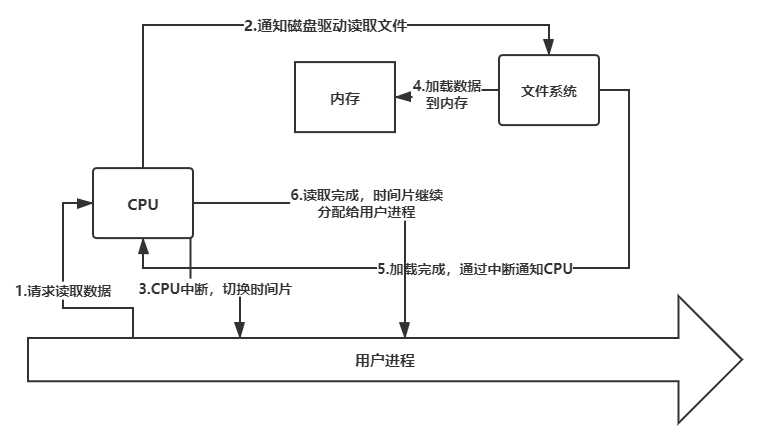
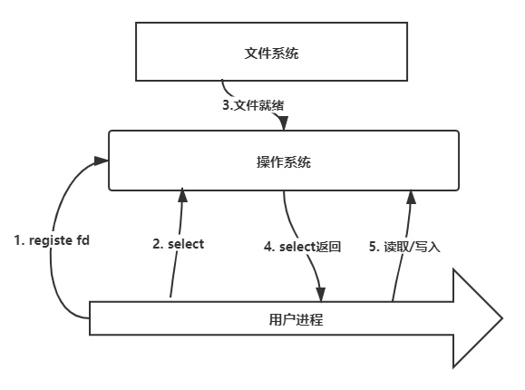

# JAVA NIO

## api介绍

### Buffer

<pre>

public abstract class Buffer {

    // Sets this buffer's mark at its position.
    public final Buffer mark();

    //Resets this buffer's position to the previously-marked position.
    public final Buffer reset();

    //Clears this buffer.  The position is set to zero, the limit is
    // set to the capacity, and the mark is discarded.
    public final Buffer clear();

    //Flips this buffer.  The limit is set to the current position 
    //and then the position is set to zero.  If the mark is defined 
    //then it is discarded.
    public final Buffer flip();

    //Rewinds this buffer.  The position is set to zero and the mark
    //is discarded.
    public final Buffer rewind();

    //Tells whether there are any elements between the current 
    //position and the limit.
    public final boolean hasRemaining()

}
</pre>

buffer类是nio中的基石，代表一个可以重复使用的缓冲区，这个缓冲区组织成一个数组的形状，有三个关键指标：

* position  //当前操作位置
* limit     //操作限制位置
* capactity //底层数组容量

当你想从读模式切换成写模式时，调用`clear()`方法，`position`设为0，`limit`设为`capactity`，整个buffer都是可以写入数据时。想要读取写入的数据，即从写模式切换成读模式，调用`flip`方法，`limit`设为当前`position`，然后`position`设为0,可以读取到最多直到刚才写入的位置的数据。

当你想重复读取数据，比如先把buffer的数据写入到channel中，然后又想把buffer的数据读入到一个数组中，可以调用`rewinds`，这个方法仅把`position`设为0,不会改变`limit`，可以重复进行读取或者写入。

`mark()`和`reset()`方法成对，用`mark()`做好标记，用`reset()`把`position`重置到`mark`锁所标记的地方，允许对某个片段重复操作。

Buffer的子类有

* ByteBuffer
* CharBuffer
* DoubleBuffer
* FloatBuffer
* IntBuffer
* LongBuffer
* ShortBuffer

这些子类分别代表某种基本类型的Buffer。这些类的实现，以ByteBuffer为例，有两种方式：

* HeapByteBuffer
* MappedByteBuffer
* DirectByteBuffer

第一种方式，`HeapByteBuffer`，和普通的java代码一样，用`new Byte[cap]`创建一个byte数组，在上面进行操作，没什么可说的。着重说下后面两种，`DirectByteBuffer`是直接用`unsafe`类申请一块堆外内存作为Buffer的底层数组，`MappedByteBuffer`则更进一步，做了一层内存映射文件(mmap)，把堆外内存数组映射到文件上，对数组的操作可以同步映射到内核空间上，并且由操作系统同步到文件上。按道理说`MappedByteBuffer`应该作为`DirectByteBuffer`的子类，但是实现上反过来了，`MappedByteBuffer`可以用`FileChannel.map()`方法创建。

### Channel

channel是nio包中对于管道的抽象，和stream有很多相似点，不同点主要集中在：

* channel的数据流通是双向的，可以读取，也可以写入
* channel能够异步的读取和写入
* channel读取，写入的作用对象永远只能是`Buffer`

Channel的重要实现有四种：

* FileChannel
* DatagramChannel
* SocketChannel
* ServerSocketChannel

`FileChannel`可以用`RandomAccessFile#getChannel()`来打开，以随机访问文件的方式打开，可以随机进行读写，利用`FileChannel.map()`，可以对这个文件做内存映射。

`DatagramChannel`是对UDP连接的管道抽象。`SocketChannel`是对客户端TCP/IP连接的管道抽象。`ServerSocketChannel`是对服务端TCP/IP连接的管道抽象。这三个类继承自`SelectableChannel`，意味着这三种管道能够进行IO多路复用操作，这也是nio包的核心功能。

能够进行读写的Channel,都有下列方法:

<pre>
    int read(Buffer);
    int read(Buffer[]);
    int write(Buffer);
    int write(Buffer[]);
</pre>

channel可以通过`read`方法，把数据从`channel`中写入到`buffer`，也可以通过`write`方法，把`buffer`的数据写入到`channel`中，`buffer`的数量可以是一个，也可以是多个。

`FileChannel`还有两个特殊的api，

<pre>
  int transferFrom(ReadableByteChannel, long, long);
  int transferTo(long, long, WritableByteChannel);
</pre>

可以直接写入或者读取到其它channel中。

### Selector

#### BlockingIO 和 NonBlockingIO

BIO是最经典的IO模型，从文件中读取或者写入数据时，进程会阻塞直到文件有数据可读或者文件可以写入数据。以读取为例，一般会经历一个这样的过程：

1. 用户请求读取数据，比如写下`inputStream.read()`。
2. CPU响应请求，向磁盘发送指令，告诉他要读取数据，并读取的地址和大小。
3. CPU中断，这一步是可选的，此时可以切换时间片，用户进程不会进行下去，就像是堵塞了一样。
4. 磁盘通过IO总线把数据写入到内存，这一步并不需要CPU的帮助。
5. 数据安全的写完之后，通过中断信号通知CPU数据已经读取过程已经完成。
6. CPU可以把时间片切换到该用户进程，从`read()`函数中返回。

假如我们使用网络编程时，这种IO模型的问题就出现了。首先，比如对于java而言，每个线程有1M(UNIX)的线程栈，为每一个连接开辟一个线程去处理时，当连接数过多，比如1k连接数，光线程栈的空间就已经占用1G了。而为每一个连接开辟一个线程又是必须的，与磁盘IO不同的是，用户进程无法知道哪个连接已经就绪，可以读取，磁盘IO几乎总是就绪的，所以用户进程必须不停的去调`read()`来试图进行读取。看样子CPU在读取时会切换时间片，好像阻塞也不会带来浪费，但是，UNIX系统在进行系统调用时，为了安全，会把原先的进程切换到内核态，然后又切给其他用户态进程，这种切换本身也是极大的消耗。

那我们怎么来减少这种系统调用呢，关键点在于用户进程需要知道何时才能去调用`read()`，用户进程能知道这个时机的话，就可以用一个线程去处理所有的连接，也可以减少大量无法读取到数据的无效调用。NIO有一种`SELECT`机制，下面是NIO的读取过程：

1. 用户进程创建一个选择器，`epoll_create()`，然后把收到的连接fd，以及感兴趣的事件，注册到操作系统中，比如C标准库中的`epoll_ctl()`。
2. 用户进程调用select过程，比如`epoll_wait`，这个阶段是一个阻塞性的过程。
3. 数据到达网卡，网卡设备通知操作系统可读。
4. 操作系统从`select`返回可用的fd集合，用户进程从函数中返回。
5. 用户进程对可用的fd进行操作。

如果我们把`register`和`select`过程分离，一个线程接受连接，另外一个线程执行会阻塞的`select`过程，并响应读取事件，只要用两个线程就能完成之前所有的事，不仅节省了线程栈空间，也减少了系统调用，一个服务器接受100k以上的请求成为可能。不过我们要注意的是，IO本身依然是同步阻塞的，对于磁盘IO而言，这些过程并不会对你的性能有多少优化。

> `select`是linux最初的nio实现，其selector是一个bitmap，最多只能1024位。select过程要全量同步所有fd，每一次返回后，重新select又要进行registe fd过程，内核本身会对selector的fd_set进行全量的遍历来了解fd是否已经就绪。`poll`进行了一点优化，把selector修改成链表，允许超过1024个监听的fd。`epoll`是poll的完全体，增量式注册fd，不要每次select注册全量的fd，selector里面包含两个数据结构，监听的fd_tree，一颗红黑树；就绪的fd链表。内核增加对应的中断处理函数，把遍历过程修改为在回调函数中主动进行，把就绪的fd添加到就绪fd链表。

了解了Selector的原理，这时候回头来看java selector的api

<pre> 
  public abstract class Selector {
    public static Selector open();
    public abstract Set[SelectionKey] selectedKeys();
    public abstract int selectNow();
    public abstract int select(long timeout);
    public abstract int select();
    public abstract Selector wakeup();
  }

  public abstract class SelectableChannel{
    public abstract SelectionKey register(Selector sel, int ops, Object att);
    public final SelectionKey register(Selector sel, int ops);
    public abstract SelectableChannel configureBlocking(boolean block);
  }
</pre>

* `Selector.open()`这个方法对应`epoll_create`的过程，创建一个selector，具体的实现依平台而定。
* `SelectableChannel.register()`这个方法对应组册fd和事件集到selector的过程，即`epoll_ctl`，可以多次调用，每次调用会覆盖掉上次调用注册的事件集，返回一个`selectionKey`。第三个参数用于绑定一个附件，便于在事件前后传递数据。注册必须发生在非阻塞的channel上，即调用了`configureBlocking(false)`的channel。
* `select`有三个重载的方法，`selectNow()`立即返回当前就绪的事件集数量，`select()`会阻塞直到有可用的事件集，`select(long)`是带超时的`select`版本。为了防止`select()`长时间阻塞，可以调用`wakeup()`设置监听线程的中断状态让`select()`抛出中断异常返回。调用`select`过后，selector的就绪事件集将会重置。
* `selectedKeys()`调用在`select()`之后，返回就绪的事件集，返回的集合是一个特殊实现的Set，非线程安全的。处理完事件后，通过调用`Set.remove()`和`Iterator.remove()`来移除已经处理完的事件，且只能通过这两个方法移除。这个事件集不支持`add`操作，会抛出异常。

#### SelectionKey

<pre>
public static final int OP_READ = 1 << 0;
public static final int OP_WRITE = 1 << 2;
public static final int OP_CONNECT = 1 << 3;
public static final int OP_ACCEPT = 1 << 4;

public abstract SelectableChannel channel();
public abstract int readyOps();
</pre>

SelectionKey包含四种事件，读写连接和接收连接，值都是2的幂次方，便于位运算。通过`readyOpts`获取就位的事件值，通过与预定义的事件值运算获取感兴趣的状态。通过`channel()`方法获取连接，转类型后进行操作。

## 一个简单的Nio服务器

<pre>
import java.net.InetSocketAddress;
import java.nio.ByteBuffer;
import java.nio.channels.SelectionKey;
import java.nio.channels.Selector;
import java.nio.channels.ServerSocketChannel;
import java.nio.channels.SocketChannel;
import java.util.Iterator;
import java.util.Set;

public class NioServer {

    public static void main(String[] args) throws Exception {
        ServerSocketChannel severChannel = ServerSocketChannel.open();
        severChannel.bind(new InetSocketAddress(6100));

        System.out.println("sever started");
        Selector selector = Selector.open();
        new Worker(selector).start();

        while (true){
            SocketChannel channel = severChannel.accept();

            System.out.println("received channel from:" + channel.getRemoteAddress());

            channel.configureBlocking(false);
            channel.register(selector, SelectionKey.OP_READ);
        }
    }
}

class Worker extends Thread {
    private final Selector selector;
    private final ByteBuffer buffer = ByteBuffer.allocate(48);

    public Worker(Selector selector){
       this.selector = selector;
    }

    @Override
    public void run() {
        System.out.println("worker started");
        while (true){
            try {
                int keyNum = selector.select(500);
                if(keyNum > 0){
                    Set&lt;SelectionKey> keys = selector.selectedKeys();
                    Iterator&lt;SelectionKey> iter = keys.iterator();
                    while (iter.hasNext()){
                        SelectionKey key = iter.next();
                        iter.remove();

                        if(key.isReadable()){
                            SocketChannel channel = (SocketChannel)key.channel();

                            buffer.clear();
                            channel.read(buffer);
                            buffer.flip();
                            channel.write(buffer);
                        } else {
                            throw new IllegalStateException();
                        }
                    }
                }
            } catch (Exception e){
                //
            }
        }
    }
}
</pre>

这个nio echo服务器分两部分，第一部分是主线程负责接收连接，并把连接组册到`Selector`中，第二部分是工作线程轮询监听selector返回的事件，如果事件就绪，连接可读，从`channel`中读取数据到`buffer`中，读取完成后，翻转`buffer`，把数据写入回`channel`，返回客户端。

把NioServer.java编译好，用strace追踪程序运行，命令如下

> strace -ff -o ./NioServer java NioServer

会在当前目录下生成运行的以NioServer为前缀的系统调用文件，后缀即是线程ID，通过`jstack`看`main()`线程的ID，并查询对应的文件。用nc连接服务端，可以观察连接建立过程中的系统调用：

----
> 2821 open("/proc/net/if_inet6", O_RDONLY)    = 7  
2974 socket(PF_INET6, SOCK_STREAM, IPPROTO_IP) = 6  
2997 bind(6, {sa_family=AF_INET6, sin6_port=htons(6100), inet_pton(AF_INET6, "::", &sin6_addr), sin6_flowinfo=0, sin6  _scope_id=0}, 28) = 0  
3003 write(1, "sever started", 13)           = 13  

----
这段日志对应的是打开socket，绑定地址的过程

----
> 3055 epoll_create(256)                       = 9  
> 3065 epoll_ctl(9, EPOLL_CTL_ADD, 7, {EPOLLIN, {u32=7, u64=12432636815209398279}}) = 0  
> 3085 clone(child_stack=0x7fd5923bdff0, flags=CLONE_VM|CLONE_FS|CLONE_FILES|CLONE_SIGHAND|CLONE_THREAD|CLONE_SYSVSEM|CLONE_SETTLS|CLONE_PARENT_SETTID|CLONE_CHILD_CLEARTID, parent_tidptr=0x7fd5923be9d0, tls=0x7fd5923be700, child_tidptr=0x7fd5923be9d0) = 23729
----

这段日志对应的是打开`Selector`，并且把文件描述符为`7`的连接（2821行日志，这是一个系统端口）组册上去，在3085行日志，创建了`worker`线程。

----
> 3105 accept(6, {sa_family=AF_INET6, sin6_port=htons(32882), inet_pton(AF_INET6, "::ffff:127.0.0.1", &sin6_addr), sin6 _flowinfo=0, sin6_scope_id=0}, [28]) = 10  
> 3135 getsockname(10, {sa_family=AF_INET6, sin6_port=htons(6100), inet_pton(AF_INET6, "::ffff:127.0.0.1", &sin6_addr), sin6_flowinfo=0, sin6_scope_id=0}, [28]) = 0  
> 3136 getsockname(10, {sa_family=AF_INET6, sin6_port=htons(6100), inet_pton(AF_INET6, "::ffff:127.0.0.1", &sin6_addr), sin6_flowinfo=0, sin6_scope_id=0}, [28]) = 0  
> 3137 write(1, "received channel from:/127.0.0.1"..., 38) = 38  
> 3171 fcntl(11, F_GETFL)                      = 0x2 (flags O_RDWR)  
> 3172 fcntl(11, F_SETFL, O_RDWR|O_NONBLOCK)   = 0

----

用 `nc localhost 6100` 去连接服务器，可以在主线程的日志里面看到上述过程，首先是接收连接，获取远端地址，打印地址，设置channel为非阻塞。

连接上服务器后，在`nc`客户端发送一条信息：  
`dhsdhsjdhsdhsjfgdsjgjgfaglkfhakjhsdkjahsdksajhdlksahdlkahdkjahdlsahdlskajhdslakjhdlkashdslkajdhjaskhd`

找到工作线程的日志，我们可以看到：

----
> 72 epoll_wait(9, [{EPOLLIN, {u32=10, u64=12512190127906226186}}], 8192, 500) = 1  
> 107 read(10, "dhsdhsjdhsdhsjfgdsjgjgfaglkfhakj"..., 48) = 48  
> 112 write(10, "dhsdhsjdhsdhsjfgdsjgjgfaglkfhakj"..., 48) = 48  
> 113 epoll_wait(9, [{EPOLLIN, {u32=10, u64=12512190127906226186}}], 8192, 500) = 1  
114 read(10, "ksahdlkahdkjahdlsahdlskajhdslakj"..., 48) = 48  
    115 write(10, "ksahdlkahdkjahdlsahdlskajhdslakj"..., 48) = 48  
    116 epoll_wait(9, [{EPOLLIN, {u32=10, u64=12512190127906226186}}], 8192, 500) = 1  
    117 read(10, "askhd\n", 48)                 = 6  
    118 write(10, "askhd\n", 6)  
----

由于`Buffer`容量有限(48)，不足以读取整段数据，填充满`buffer`，移除事件，`channel`实际上依然有可读数据。下一次调用`select()`方法时，依然会返回这个`channel`的读取事件，供我们继续读取。这个是因为java默认实现使用的是`epoll`的水平触发模式。

