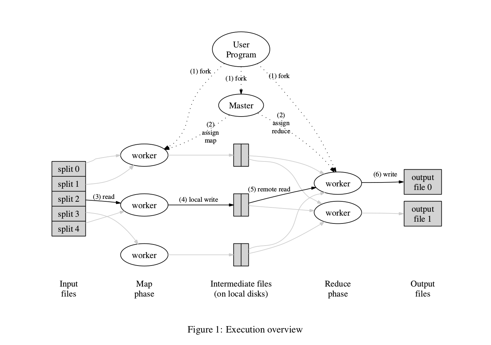

# mapreduce

[mapreduce论文](https://pdos.csail.mit.edu/6.824/papers/mapreduce.pdf)

## mapreduce函数

```cpp
map (k1,v1) → list(k2,v2)
reduce (k2,list(v2)) → list(v2)
```

* map: 输入记录(k1, v1)，转换成记录 (k2, v2)，这个转换过程是和上下文无关的。

* reduce: 输入记录(k2, list(v2))，其中list(v2)是map过程中同一个k值的所有相关v值聚合产生的，对每个list(v2)执行reduce过程，产生一个v2值，得到所有不同k值的结果列表，这个过程是上下文相关的。

## 实现



一个典型的分布式实现如上图，可分为下列步骤：

1. 用户或者mapreduce框架把用户输入文件划分成16M-64M大小的分段，并均匀的分配到要执行计算的服务器上。

2. 用户提交mapreduce任务或者在自己的程序中创建master、worker节点。master节点用来分配任务，worker节点用来执行计算任务

3. master把map任务分配到worker当中，为了保持良好的局部性，输入文件和对应的map worker放在同一台机器上。worker读取输入文件，调用用户定义的map函数，得到中间结果，可以按照`hash(key) mod reduceNum`，把中间结果划分好保存到本地的中间输出文件，提供给对应的reduce worker使用，结束后通知master。

4. reduce worker接到master通知后，从worker上远程读取已划分好给自己的中间文件，再执行用户定义的reduce函数，得到输出结果写入到输出文件当中。

5. master得知所有的工作已经完成，从函数中返回到用户程序。

这个实现隐含了一些依赖的背景工具：

* 一个分布式文件系统，mapreduce框架需要worker频繁的在本地或者远程读取、写入文件，worker从远程读取文件，除了速度以外，应该表现得就像从本地读取文件。在google mapreduce实现中是GFS。

* 一个在master和worker间协调的分布式工具。

## 容错性

### worker故障

即使每个worker出现故障的概率很小，在大规模集群中，足够大的数量也能使得整个集群在每数分钟中都会出现worker故障。master会对所有worker做心跳检测，当发现worker有故障后，会对worker上任务的不同阶段做不同的处理。

对于map阶段的任务，中间文件是缓存在本地的，worker故障也就意味着中间文件不能被访问到了，这时候是选择把这个任务分配到其它机器上。对于reduce阶段的任务，如果任务正在进行中，将会重新分配，如果任务是已完成并且已经通知到了master，输出文件提交到了全局的文件系统中，reduce任务不会被重新分配。

### master故障

一般master可以选择定时保存暂存点，当master失败后，从暂存点恢复工作，这样能节省工作时间。但是实际上master经常是只有一台机器，失败的概率很小，从暂存点恢复带来的实现难度超过节省工作时间的收益，遇到这种情况，会直接放弃整个mapreduce任务，由客户选择是否重启这个任务。

### 原子提交

map任务和reduce任务一开始输出的是缓冲文件，这个缓冲文件属于任务进程且是随时更改的，在提交结果至master时，利用文件系统的原子命名，把这个缓冲文件重命名为提交文件的文件名，这个文件名是惟一的，避免多备份情况下出现的冲突。

### 任务形式

和纯函数类似，map、reduce任务是要求输出结果仅仅取决于输入结果，map、reduce任务执行的节点、时间或者其它因素不会影响到处理结果，这样的话能够自由的去分配节点任务。对于reduce任务，即reduce的结果不依赖输入的顺序（比如reduce任务满足交换律、reduce任务会对输入进行排序），在实际工作中，reduce任务读取所有map中间文件的顺序不是固定的，这种顺序不应该影响到reduce的输出结果。

## 局部性

在分布式系统中，带宽是宝贵的资源。在mapreduce依赖的GFS中，每个文件通常有三个备份分布在系统中不同节点上。对于无上下文依赖的map任务，要保持局部性，master尽量要做到把map任务分配到输入文件对应的备份节点上。当worker失败后，master也可以选择另外备份所在机器来重启这个map任务。

reduce任务要搜集某个特殊的key所有的map结果，不可避免的要去搜集所有中间文件。map所得到的结果，要尽可能的小，降低reduce进行远程访问的流量。必要时，可以进行shuffle过程，在map阶段执行在本地执行可以执行的reduce操作，比如word count任务时可以在map阶段就对word进行计数，reduce阶段进行各个map所得结果的聚合。

## 任务细粒度

任务划分得越细，更有利于在节点间的负载均衡，在worker节点失败后，能更快的从失败中恢复。但是当细粒度越细时，带来的问题是master所要管理的状态的暴增，master要管理`O(M+N)`个任务状态和`O(M*N)`个中间文件状态，而且reduce任务需要读取远程中间文件的网络调用次数也因此增多。在Google的经验中，Input = 16-64M， M = 200000, R = 5000, Woker = 2000是一种很好的实践。

在map、reduce任务中，可能会由于键的分布不均匀,worker机器本身性能存在问题，导致少部分任务执行很长的时间，从而延长整个任务的时间。在MapReduce中，会在任务的最后阶段，把少量未完成的任务在备份机器执行，然后选择先完成的计算作为结果，这种操作能有效的降低整体计算时间。

## 优化方向

### 分区函数

一个有效的分区函数是提高reduce任务均衡性的重要组成，一般`Hash(key) mod R`就是个足够好的分区函数。在某些特殊情况下，可以基于这个函数改良，比如统计url访问次数，我们想把同一个域名下的计数交给同一个reduce任务计数，这时候分区函数可以用`Hash(Host(url)) mod R`来实现这个功能。

### 顺序保证

MapReduce不提供全局顺序，但是保证在每个分区，即每个R任务，处理key是有序的，Reduce任务输出结果保持这个顺序。为需要随机查找结果的任务提供了方便。

### 连接函数

从数学上可以证明，当reduce函数是符合交换律、结合率的话，reduce的执行和顺序无关，也就是说，可以在本机上对中间文件执行reduce任务。一般而言，连接函数可以直接用reduce。使用连接函数预先处理map结果能有效降低reduce任务访问远程文件的流量。

### 副作用

map、reduce的主要副作用是写入文件，框架强依赖文件写入、重命名的原子性。

### 跳过错误记录

用户自定义的map、reduce函数在处理某些记录时会出错，这些错是与框架无关的。在一些情况下，可以放弃部分record来继续执行，比如在wc中，计数多了几个或者少了几个对于大规模任务中不是特别的重要。mapreduce提供了可选项让用户代码在处理时出现了错误后如何去解决，选择放弃还是跳过错误记录继续执行。

### 监控

mapreduce提供了监控页面来监控当前任务分配情况、执行情况、输入输出文件等程序运行信息，以供用户对任务执行有可直观的感受。
