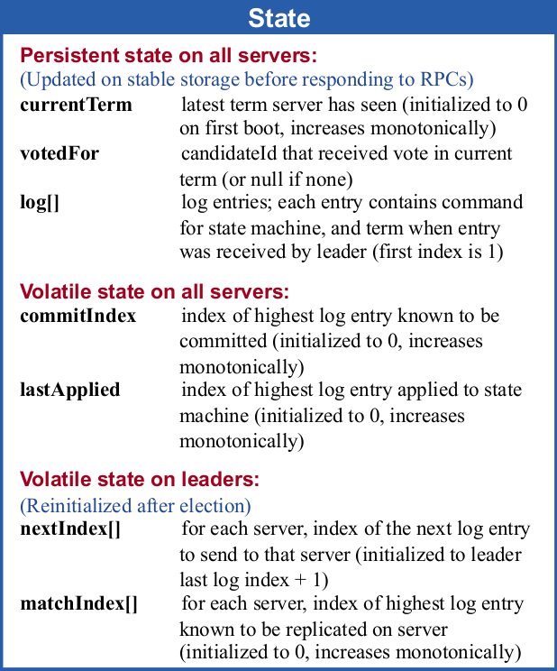
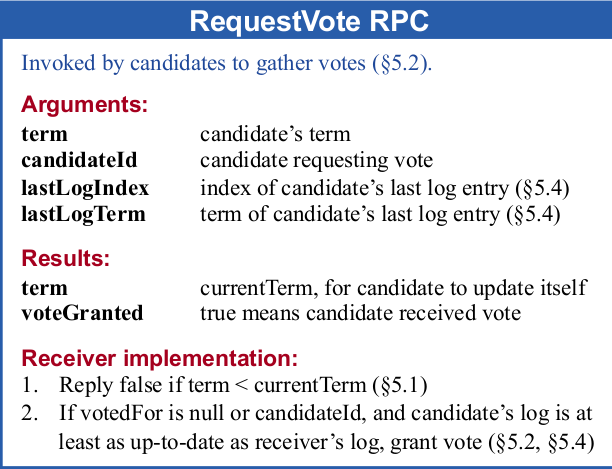
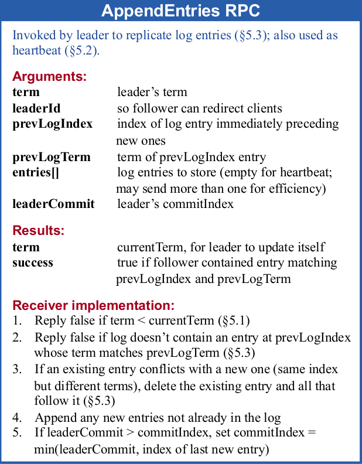
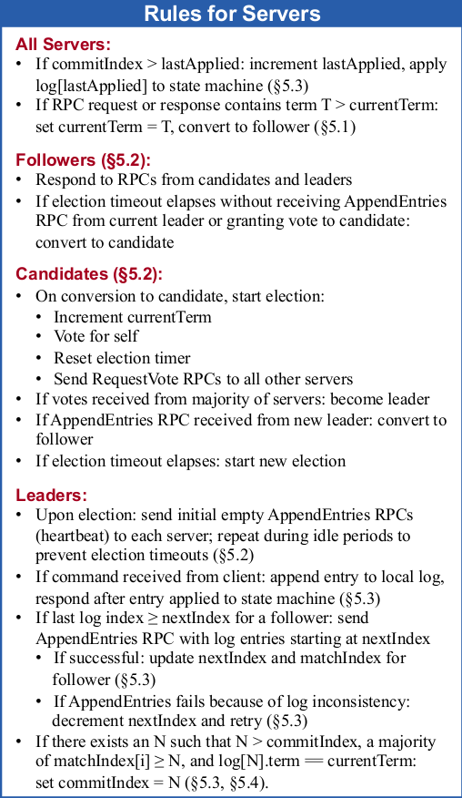
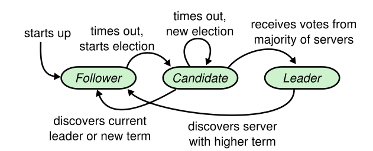

# Raft

## Resources

[raft paper](https://pdos.csail.mit.edu/6.824/papers/raft-extended.pdf)

[raft visualization](http://thesecretlivesofdata.com/raft)

[raft lab](https://pdos.csail.mit.edu/6.824/labs/lab-raft.html)

[raft lab impl suggest](https://thesquareplanet.com/blog/students-guide-to-raft/)

## Question

* Leader Election
* Log Replication
* Membership Change
* Safety

## Summary

 

 

 

 

## algotithm

### State Machine

### Leader Election

> Leader(处理客户端请求，分发日志到Follower节点)  
> Follower(在选举阶段进行投票，接收Leader日志)  
> Candidate(发起选举，获取多数投票后转换成Leader)

1. 集群用一个单调递增的数字戳Term作为系统时钟
2. Follower在一个Term阶段只给惟一的Candidate投票
3. 在一个Term阶段获取到超过二分之一得票的Candidate转化成这个阶段的Leader

规则`(1,2,3)`将集群划分成不同的时间段，在每一个时间段T，由`投票惟一(2)`和`大多数得票(3)`的规则，只能确立最多一个Leader。

集群中各节点通过RPC交流，节点需要通过与其它节点的交换信息才能确定自己的状态，每个rpc请求或者响应都携带节点的Term。

4. 当节点收到rpc请求或者响应时，如果请求或者响应携带的Term T1大于节点的Term T2，令 T2 = T1，节点状态切换至Follower

规则`(1,4)`是Term变化的所有规则，Term仅在从Follower转变成Candidate、Candidate继续转变成下一个阶段的Candidate、RPC交流发现有节点Term大于自身Term这三种情况下递增，不能减少，其它情况保持不变。

5. 当Follower节点在Term `T`持续一段时间后接收不到Leader`(T)`的请求，转换成Candidate`(T+)`，递增节点Term到`T+`，向其它服务器发起投票请求。当Candidate在一段时间内没有收到大多数票，且没有收到此阶段的Leader`（T+)`的请求，转换成下一阶段的Candidate`(T++)`。

Leader节点发送RPC请求来阻止Follower节点转变成Candidate，这个请求称之为心跳。当Follower在一段时间内持续不能收到心跳，意味着可能与Leader节点的连接已经断开，或者Leader节点已经挂掉。节点本身没有足够的信息来判断究竟发生了什么，但是可以采取固定的处理方式，Follower转化成下一个阶段的Candiate来发起投票请求试图成为Leader。

在一轮竞选中，所有的Candidate可能都拿不到足够的票数，造成这个的原因可能有网络分区，没有一个分区能够有合法票数以上的节点互联。投票分散，每个Candidate都拿到一些票，但是又都拿不到合法票数。这一轮投票不能决出Leader，Candidate可以继续转换成下一阶段的Candidate重复进行选举。

6. 当Follower节点收到投票请求时，投票给请求者。

规则`6`是Raft的投票算法，采取先来先到。如果Follower自身没能转换成Candidate给自己投票，而是接到其它Candidate的投票请求，先收到谁的请求，就给谁投票。这个规则简单，RPC交流的信息非常少，算法实现也简单。

为了避免出现多轮空选的情况，每个节点选择一个随机的ElectionTimeout，来错开转换成Candidate的时机，使得有一些节点能够更早的转换成Candidate拿到选票。Leader节点发送心跳的频率一般选择在一个ElectionTimeout内能够发送10个心跳，即使在网络抖动下，也能避免过于频繁的选举。

### Log Republication

### Safaty
