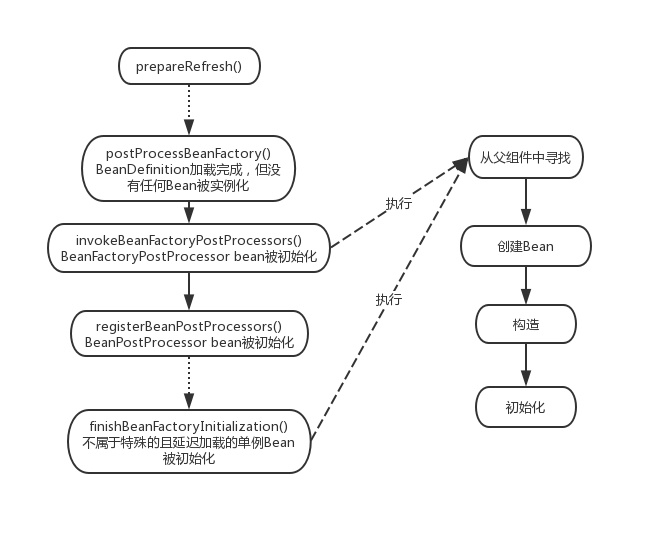

## Spring容器概览

Spring是作为容器的存在，在谈容器之前，先了解容器里面装着的组件。spring一开始就是作为管理组件间依赖关系管理的存在，核心就是实现依赖注入和控制反转。组件间的依赖关系，在spring里面抽象为`BeanDefinition`

* BeanDefinition
<pre>
parentName
beanClassName
factoryBeanName
factoryMethodName
scope
lazyInit
dependsOn
autowireCandidate
primary
constructorArgumentValues
propertyValues
singleton protype
abstact
</pre>

BeanDefinition里面包含着描述组件本身和相互间依赖关系的属性，比如描述自身的beanClassName、constructorArgumentValues、propertyValues等，和描述依赖关系的dependsOn、autowireCandidate、scope、singleton protype等。这个接口描绘了Spring Bean的定义和依赖的全貌。

管理BeanDefinition的组件是`BeanDefinitionRegistry`接口，这个接口的方法如下：

* BeanDefinitionRegistry
<pre>
void registerBeanDefinition(String beanName, BeanDefinition beanDefinition)
void removeBeanDefinition(String beanName)
BeanDefinition getBeanDefinition(String beanName)
boolean containsBeanDefinition
String[] getBeanDefinitionNames()
int getBeanDefinitionCount()
boolean isBeanNameInUse(String beanName)
</pre>

从这些方法中看，BeanDefinitionRegistry被描绘成一个管理BeanDefinition的容器，在这个容器中可以注册、移除、获取BeanDefinition，最直观的实现方式就是用一个Map来存放BeanDefinition来实现上述接口。

Spring提供了两种类型的接口来描述容器，实现基本功能的`BeanFactory`和实现高级功能的`ApplicationContext`，两种接口的继承关系如下图所展示：

`BeanFactory`作为最基本的容器，提供基本的按照beanName来获取Bean的功能。ListableBeanFactory提供了批量获取的功能，其中annotation作为Spring的一等公民，这个接口特意提供了getBeansForAnnotation的方法。`AutowireCapableBeanFactory`提供bean生命周期管理的功能，其中有createBean、configureBean、initializeBean、destroyBean等生命方法。`HierarchicalBeanFactory`提供了beanFactory相互继承的功能。`DefaultListableBeanFactory`提供了BeanFactory一系列接口一个完整的实现。

`ApplicationContext`通过继承这三个接口获得了完善的容器功能，从getAutowireCapableBeanFactory这个方法可以看出，applicationContext更建议通过持有BeanFactory对象来实现功能。除了从BeanFactory继承过来的容器功能，通过继承`MessageResource`、`ApplicationEventPublisher`、`ResourcePatternResolver`这些接口，ApplicationContext得到了作为消息源、事件发布器、资源解析器等功能。

我们常用到的`WebApplicationContext`，继承了ApplicationContext接口，增加了getServletContext方法，与servlet容器结合成为可能，`ConfigurableApplicationContext`又增加了配置容器的功能。

## ApplicationContext的初始化

Spring的官方文档提供了如下的示例来使用ApplicationContext:
<pre>
// create and configure beans
ApplicationContext context = new ClassPathXmlApplicationContext("services.xml", "daos.xml");

// retrieve configured instance
PetStoreService service = context.getBean("petStore", PetStoreService.class);
</pre>

上面的示例展示了创建一个ApplicaitonContext并从中获取bean的示例。从另一个示例中，能更清晰的看到applicationContext是如何运作的：
<pre>
GenericApplicationContext context = new GenericApplicationContext();
new XmlBeanDefinitionReader(context).loadBeanDefinitions("services.xml", "daos.xml");
context.refresh();
</pre>

这个案例的过程如下：

1. 创建一个GenericApplicationContext
2. 创建一个BeanDefinitionReader并从资源文件中读取beanDefinition结构定义和解析
3. 刷新context

核心过程在context的refresh方法，这个方法的实现在`AbstractApplicationContext.refresh()`方法里面。我们将沿着context的初始化和bean的初始化两条路线来叙述，第一条路线是context的初始化，也就是`refresh()`方法，这个方法实现过程的如下：

* AbstractApplicationContext.refresh()
<pre>
    prepareRefresh();

    // Tell the subclass to refresh the internal bean factory.
    ConfigurableListableBeanFactory beanFactory = obtainFreshBeanFactory();

    // Prepare the bean factory for use in this context.
    prepareBeanFactory(beanFactory);

    // Allows post-processing of the bean factory in context subclasses.
    postProcessBeanFactory(beanFactory);

    // Invoke factory processors registered as beans in the context.
    invokeBeanFactoryPostProcessors(beanFactory);

    // Register bean processors that intercept bean creation.
    registerBeanPostProcessors(beanFactory);

    // Initialize message source for this context.
    initMessageSource();

    // Initialize event multicaster for this context.
    initApplicationEventMulticaster();

    // Initialize other special beans in specific context subclasses.
    onRefresh();

    // Check for listener beans and register them.
    registerListeners();

    // Instantiate all remaining (non-lazy-init) singletons.
    finishBeanFactoryInitialization(beanFactory);

    // Last step: publish corresponding event.
    finishRefresh();
</pre> 

这里展示的代码删除了错误处理相关的代码，保留了核心流程，以下将展示重要流程的实现，以及我们常见的功能是如何实现的，我们如果要在spring基础上自定义开发，如何使用这些桩。

> 1.prepareRefresh()

这个过程主要是把容器标记为激活状态，并准备环境资源，占位符资源

> 2.obtainFreshBeanFactory()

这个过程中，会创建一个全新的beanFactory，并执行获取、解析、注册beanDefinition的过程。Spring提供了相应的抽象，作为资源的`Resouce`接口，是xml、groovy、class等文件或代码的统一资源抽象，作为BeanDefinition解析的解析器`BeanDefinitionReader`，读取、解析相应的资源文件并转换成BeanDefinition结构。在Spring Application中，过去`XmlBeanDefinitionReader`显得格外的重要，但在Springboot Application中，这个reader的功能被极大的弱化了。解析过程过于繁琐，不在这里赘述。解析完成后，BeanDefinition被注册到BeanDefinitionRegistry中，在这里要说的是，BeanFactory和Application的实现类普遍也实现了`BeanDefinitionRegistry`接口，这个BeanDefinitionRegistry也就是BeanFactory本身。

在这个过程中，Spring Application能完成大部分BeanDefinition的解析、注册。而在Springboot Application中，事情有点不同。Springboot Application是把Application Context包装成SpringApplication，创建一个全新的DefaultListableBeanFactory，并把启动的参数类注册到容器中去，并注册必要的BeanDefinition。此时，ApplicationContext中仅有相当少量的beanDefinition。

> 3.prepareBeanFactory(beanFactory)

这个过程主要是为BeanFactory做一些准备工作，比如设置Bean加载的ClassLoader，增加ApplicationContextAwareProcessor，对FactoryAware类似的依赖设置忽略自动注入，因为此时没有任何Bean进行实例化过程，Bean可以通过实现Aware接口来实现这类属性的注入。

> 4.postProcessBeanFactory(beanFactory)

这个过程会不在不同的子类实现中执行一些BeanFactory后置处理过程，比如`ServletWebServerApplicationContext`里面会增加`ServletContextAware`相关的Processor和设置其忽略依赖，而`AnnotationConfigServletWebServerApplicationContext`中会开始执行对指定的包和指定的annotation扫包过程。

> 5.invokeBeanFactoryPostProcessors(beanFactory)

这个过程中调用标准的`BeanFactoryPostProcessor`后置处理器，这些后置处理器实现了BeanFactoryPostProcessor接口，这个接口如下：

* BeanFactoryPostProcessor
<pre>
void postProcessBeanFactory(ConfigurableListableBeanFactory beanFactory) throws BeansException;

public interface ConfigurableListableBeanFactory
		extends ListableBeanFactory, AutowireCapableBeanFactory, ConfigurableBeanFactory
</pre>

BeanFactoryPostProcessor相关的实现作为Bean来注册到容器中，在此时，可以对BeanFactory执行修饰，这里的参数为`ConfigurableBeanFactory`类型，这个类型的BeanFactory继承了所有BeanFactory系列主流的接口，也就是说这个方法里面能执行比较完备的修饰功能。

BeanFactoryPostProcessor有一个特殊的子接口`BeanDefinitionRegistryPostProcessor`，这个接口的定义如下：

* BeanDefinitionRegistryPostProcessor
<pre>
void postProcessBeanDefinitionRegistry(BeanDefinitionRegistry registry) throws BeansException;
</pre>

这个接口的参数是`BeanDefinitionRegistry`，我们可以对其进行修饰，这意味着，我们可以在此时动态添加或者删除BeanDefinition，即动态注册自定义Bean，有很多框架会在此时把自身的特殊Bean注册到Spring容器中，比如：

<pre>
ConfigurationClassPostProcessor(spring)

MapperScannerConfigurer(mybatis)

ServiceAnnotationBeanPostProcessor(dubbo)
</pre>

`ConfigurationClassPostProcessor`会从@ComponentScans为起点，扫描所有`@Configuration`所标记的类，并将其中`@Bean`方法标记的返回类解析注册成BeanDefinition，SpringBoot在beanFactory初始化的时候会准备这个PostProcessor,来把系统中大部分BeanDefinition注册到容器中。与此同时还会执行把`@Component`，`@Configuration`，`@Bean`等注解标记的类注册到容器中。这个类最后执行从`@ImportResouce`标记的资源，或`ImportBeanDefinitionRegistrar`外部注册器导入bean的解析和注册，比如Mybatis的`MapperScannerRegistrar`。

* ImportBeanDefinitionRegistrar
<pre>
void registerBeanDefinitions(AnnotationMetadata importingClassMetadata, BeanDefinitionRegistry registry);
</pre>

`MapperScannerConfigurer`是mybatis所使用的注册类，这个类会执行Mapper文件的扫描注册工作。

`ServiceAnnotationBeanPostProcessor`是dubbo所使用的注册类，这个类会扫描@Service标记的服务注册成Spring BeanDefinition。

注册过程中会用到一个很实用的工具类`ClassPathBeanDefinitionScanner`，通过继承这个类，可以自定义type filter规则来对指定路径下所有类进行扫描并解析成BeanDefinition并注册到BeanRegistry中。

这个过程是外部框架把自身bean注册到Spring容器的好时机，Springboot也把自己的大部分beanDefinition的注册放在这个时候。

> 6.registerBeanPostProcessors(beanFactory);

这个时候执行BeanPostProcessor的注册过程，BeanPostProcessor以Bean的形式注册到容器中，注册的Processor实例如果同时实现了`PriorityOrdered`接口，注册时会按照优先级对processor进行排序，后序的执行会按照这个顺序进行调用。BeanPostProcessor作为bean的后置处理器，有以下方法:

* BeanPostProcessor
<pre>
Object postProcessBeforeInitialization(Object bean, String beanName) throws BeansException
Object postProcessAfterInitialization(Object bean, String beanName) throws BeansException
</pre>

这两个方法分别在Bean初始化前后调用，BeanPostProcessor有一个重要的子接口，`InstantiationAwareBeanPostProcessor`，这个子接口的方法如下：

* InstantiationAwareBeanPostProcessor
<pre>
Object postProcessBeforeInstantiation(Class<?> beanClass, String beanName) throws BeansException
boolean postProcessAfterInstantiation(Object bean, String beanName) throws BeansException
PropertyValues postProcessProperties(PropertyValues pvs, Object bean, String beanName)
			throws BeansException
</pre>

这个接口的方法从方法名可以看出，会在bean实例化前后调用两个接口，另外一个方法是在beanFactory对bean设置属性之前调用，我们能对属性进行修饰。这个接口也有个子接口`SmartInstantiationAwareBeanPostProcessor`：

* SmartInstantiationAwareBeanPostProcessor
<pre>
Class<?> predictBeanType(Class<?> beanClass, String beanName) throws BeansException
Constructor<?>[] determineCandidateConstructors(Class<?> beanClass, String beanName)
			throws BeansException
Object getEarlyBeanReference(Object bean, String beanName) throws BeansException
</pre>

这个接口有三个方法，第一个方法是决定bean最终会以什么类型呈现，比如以创建代理的类型（代理的类型为原类型的子类型）来替换原类型，第二个方法是提取出决定Bean可供采用的构造器列表，在自动装配时会用到。第三个方法时暴露bean早期的reference，此时bean只是被实例化但没有被初始化，可以用来解决循环依赖的问题。

这三个接口构成了bean生产过程的回调，给bean全方位修改提供了必要的条件和手段，更详细的介绍会放在获取bean的过程中。

BeanPostProcessor常用的子接口有`ApplicationContextAwareProcessor`、`ServletContextAwareProcessor`，对实现了ApplicationContextAware和ServletContextAware的bean在初始化完成后注入context。bean通过这种方式来感知context的存在，而不是通过依赖注入，如上，此类属性的依赖注入在没有任何bean实例化前就已经被设置成忽略掉了。

> 7.initMessageSource();
>
> 8.initApplicationEventMulticaster();
>
> 10.registerListeners();

这三个过程是实现application作为消息源和事件中心的功能，事件的基类是ApplicationEvent，Context相关的事件继承自ApplicationContextEvent，有conxt started、refresh、stop、close等事件。EventMulticaster广播器会把ApplicationContext.publishEvent()方法里面发送的事件异步的交给订阅了指定类型监听器去执行。可以用过实现ApplicationListener接口来自定义监听器：

* ApplicationListener<E extends ApplicationEvent>
<pre>
void onApplicationEvent(E event);
</pre>

> 9.onRefresh()

这里会执行一些特殊bean的构造和初始化，比如Springboot的`ReactiveWebServerApplicationContext`会在此时用netty创建一个http服务器，`ServletWebServerApplicationContext`会根据外挂的包来用tomcat或者jetty创建一个传统的servlet服务器。

> 10.finishBeanFactoryInitialization(beanFactory);

这个阶段会结束BeanFactory的初始化过程，首先冻结已有的BeanDefinition，使得这一部分的BeanDefinition不能被修改。在之前的过程中，其实已经初始化了BeanFactoryPostProcessor、BeanPostProcessor、ApplicationListener系列的Bean，剩下的单例bean的初始化在这个阶段全部被初始化。

> 11.finishRefresh();

这个阶段做收尾工作。清理资源缓存，比如在扫包过程中产生的ASM元数据，初始化`LifecycleProcessor`，并执行onRefresh方法，发布`ContextRefreshedEvent`，激活MBean管理服务等。

## Spring Bean初始化过程

Bean的创建和初始化过程是和Context Refresh过程交织在一起，它们之间的交织关系可以用下面的图来展示：

在上面展示的第五个阶段，`BeanDefinitionRegistryPostProcessor`这一类Bean首先被初始化并进行执行，扫描BeanDefinition注册到BeanFactory中，当新增加的BeanDefinition中又发现这一类Registry后，会继续初始化执行，最后会初始化其余普通的BeanFactoryPostProcessor来执行，这个阶段的Bean，除了`ApplicationContextAwareProcessor`（这个Processor是在第三阶段就注册好了），无法享受其它BeanPostProcessor的处理。在第六个阶段，会去注册BeanPostProcessor，此时BeanDefinition已经完全的确定下来了，context会根据BeanDefinition，从中获取元数据来进行排序，以保证BeanPostProcessorde的有序加载。主要是保证Bean生命周期Processor，比如`InstantiationAwareBeanPostProcessor`的预先加载，使得后续的BeanPostProcessor也能得到已经初始化的BeanPostProcessor的处理。

Bean的创建及初始化过程，从`BeanFactory.getBean()`方法开始，具体的实现分散在很多方法里面，这里逐一解释。

> AbstractBeanFactory.doGetBean

这个方法首先会从父BeanFactory里面查找，查找不到后，才会自己创建Bean，创建Bean前，会检查BeanDefinition里面指定的依赖，递归的调用依赖的getBean来初始化依赖，最后执行createBean方法。

> AbstractAutowireCapableBeanFactory.createBean

这个阶段是构建bean的过程，在构建前，用户有一次选择用proxy来替换从BeanDefinition决定的Bean的机会:

* AbstractAutowireCapableBeanFactory.resolveBeforeInstantiation()
<pre>
Class<?> targetType = determineTargetType(beanName, mbd);
if (targetType != null) {
    bean = applyBeanPostProcessorsBeforeInstantiation(targetType, beanName);
    if (bean != null) {
        bean = applyBeanPostProcessorsAfterInitialization(bean, beanName);
    }
}
</pre>
这里使用的是`InstantiationAwareBeanPostProcessor`接口，用户可以选择实现这个接口来对指定的Bean创建代理来替换BeanDefinition里面所定义的Bean。一般的，框架会更多选择去继承`InstantiationAwareBeanPostProcessorAdapter`这个抽象类，这个适配器是jdk8以前，没有默认方法，框架可以通过继承选择只实现部分需要的接口。这个接口的实现有：

<pre>
AutowiredAnnotationBeanPostProcessor(spring)

ReferenceAnnotationBeanPostProcessor(dubbo)
</pre>

接下来调用的是

> AbstractAutowireCapableBeanFactory.doCreateBean()

这个阶段是创建Bean并设置属性的阶段。首先是在调用Bean的构造器构造Bean之前，会对`SmartInstantiationAwareBeanPostProcessor`的`determineCandidateConstructors()`以便让BeanFactory选择采用何种构造器来进行构造。构造这一步完成后，就是初始化Bean的时期。

Bean的属性初始化分成两部分，第一部分执行的populateBean方法，这个方法设置的属性是在BeanDefinition里面设置好的属性，从BeanDefinition中抽取属性时，会回调`InstantiationAwareBeanPostProcessor`的`postProcessProperties()`方法，dubbo的`ReferenceAnnotationBeanPostProcessor`选择在这个时候去把`Invoker`包装成`Reference`来注入属性，dubbo的这些ReferenceBean是在自己管理的容器里面，并没有注册到Spring容器中。

第二部分执行的是`initializeBean`

