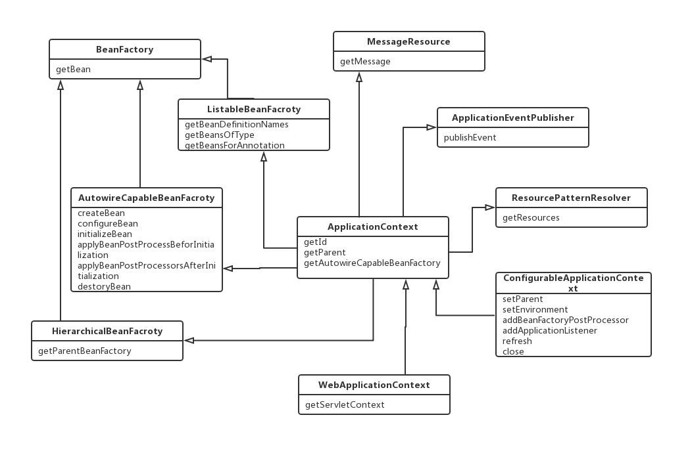

Spring是作为容器的存在，在谈容器之前，先了解容器里面装着的组件。spring一开始就是作为管理组件间依赖关系管理的存在，核心就是实现依赖注入和控制反转。组件间的依赖关系，在spring里面抽象为BeanDefinition

* BeanDefinition
<pre>
parentName
beanClassName
factoryBeanName
factoryMethodName
scope
lazyInit
dependsOn
autowireCandidate
primary
constructorArgumentValues
propertyValues
singleton protype
abstact
</pre>

BeanDefinition里面包含着描述组件本身和相互间依赖关系的属性，比如描述自身的beanClassName、constructorArgumentValues、propertyValues等，和描述依赖关系的dependsOn、autowireCandidate、scope、singleton protype等。这个接口描绘了Spring Bean的定义和依赖的全貌。

管理BeanDefinition的组件是BeanDefinitionRegistry接口，这个接口的方法如下：

* BeanDefinitionRegistry
<pre>
void registerBeanDefinition(String beanName, BeanDefinition beanDefinition)
void removeBeanDefinition(String beanName)
BeanDefinition getBeanDefinition(String beanName)
boolean containsBeanDefinition
String[] getBeanDefinitionNames()
int getBeanDefinitionCount()
boolean isBeanNameInUse(String beanName)
</pre>

从这些方法中看，BeanDefinitionRegistry被描绘成一个管理BeanDefinition的容器，在这个容器中可以注册、移除、获取BeanDefinition，最直观的实现方式就是用一个Map来存放BeanDefinition来实现上述接口。

Spring提供了两种类型的接口来描述容器，实现基本功能的BeanFactory和实现高级功能的ApplicationContext，两种接口的继承关系如下图所展示：

BeanFactory作为最基本的容器，提供基本的按照beanName来获取Bean的功能。ListableBeanFactory提供了批量获取的功能，其中annotation作为Spring的一等公民，这个接口特意提供了getBeansForAnnotation的方法。AutowireCapableBeanFactory提供bean生命周期管理的功能，其中有createBean、configureBean、initializeBean、destroyBean等生命方法。HierarchicalBeanFactory提供了beanFactory相互继承的功能。DefaultListableBeanFactory提供了BeanFactory一系列接口一个完整的实现。

ApplicationContext通过继承这三个接口获得了完善的容器功能，从getAutowireCapableBeanFactory这个方法可以看出，applicationContext更建议通过持有BeanFactory对象来实现功能。除了从BeanFactory继承过来的容器功能，通过继承MessageResource、ApplicationEventPublisher、ResourcePatternResolver这些接口，ApplicationContext得到了作为消息源、事件发布器、资源解析器等功能。

我们常用到的WebApplicationContext，继承了ApplicationContext接口，增加了getServletContext方法，与servlet容器结合成为可能，ConfigurableApplicationContext又增加了配置容器的功能。

Spring的官方文档提供了如下的示例来使用ApplicationContext:
<pre>
// create and configure beans
ApplicationContext context = new ClassPathXmlApplicationContext("services.xml", "daos.xml");

// retrieve configured instance
PetStoreService service = context.getBean("petStore", PetStoreService.class);
</pre>

上面的示例展示了创建一个ApplicaitonContext并从中获取bean的示例。从另一个示例中，能更清晰的看到applicationContext是如何运作的：
<pre>
GenericApplicationContext context = new GenericApplicationContext();
new XmlBeanDefinitionReader(context).loadBeanDefinitions("services.xml", "daos.xml");
context.refresh();
</pre>

这个案例的过程如下：

1. 创建一个GenericApplicationContext
2. 创建一个BeanDefinitionReader并从资源文件中读取beanDefinition结构定义和解析
3. 刷新context

核心过程在context的refresh方法，这个方法的实现在`AbstractApplicationContext.refresh()`方法里面，这个方法实现过程的如下：

* AbstractApplicationContext.refresh()
<pre>
    prepareRefresh();

    // Tell the subclass to refresh the internal bean factory.
    ConfigurableListableBeanFactory beanFactory = obtainFreshBeanFactory();

    // Prepare the bean factory for use in this context.
    prepareBeanFactory(beanFactory);

    // Allows post-processing of the bean factory in context subclasses.
    postProcessBeanFactory(beanFactory);

    // Invoke factory processors registered as beans in the context.
    invokeBeanFactoryPostProcessors(beanFactory);

    // Register bean processors that intercept bean creation.
    registerBeanPostProcessors(beanFactory);

    // Initialize message source for this context.
    initMessageSource();

    // Initialize event multicaster for this context.
    initApplicationEventMulticaster();

    // Initialize other special beans in specific context subclasses.
    onRefresh();

    // Check for listener beans and register them.
    registerListeners();

    // Instantiate all remaining (non-lazy-init) singletons.
    finishBeanFactoryInitialization(beanFactory);

    // Last step: publish corresponding event.
    finishRefresh();
</pre> 

这里展示的代码删除了错误处理相关的代码，保留了核心流程，以下将展示重要流程的实现，以及我们常见的功能是如何实现的，我们如果要在spring基础上自定义开发，如何使用这些桩。

> prepareRefresh()

这个过程主要是把容器标记为激活状态，并准备环境资源，占位符资源

> obtainFreshBeanFactory()

这个过程中，会创建一个全新的beanFactory，并执行获取、解析、注册beanDefinition的过程。Spring提供了相应的抽象，作为资源的Resouce接口，是xml、groovy、class等文件或代码的统一资源抽象，作为BeanDefinition解析的解析器BeanDefinitionReader，读取、解析相应的资源文件并转换成BeanDefinition结构。在Spring Application中，过去XmlBeanDefinitionReader显得格外的重要，但在Springboot Application中，这个reader的功能被极大的弱化了。解析过程过于繁琐，不再赘述。解析完成后，BeanDefinition被注册到BeanDefinitionRegistry中，在这里要说的是，BeanFactory和Application的实现类普遍也实现了BeanDefinitionRegistry接口，这个BeanDefinitionRegistry也就是BeanFactory本身。

在这个过程中，Spring Application能完成大部分BeanDefinition的解析、注册。而在Springboot Application中，事情有点不同。Springboot Application是把Application Context包装成SpringApplication，创建一个全新的DefaultListableBeanFactory，并把启动的参数类注册到容器中去，并注册必要的BeanDefinition。此时，ApplicationContext中仅有相当少量的beanDefinition。

> prepareBeanFactory(beanFactory)

这个过程主要是为BeanFactory做一些准备工作，比如设置Bean加载的ClassLoader，增加ApplicationContextAwareProcessor，对FactoryAware类似的依赖设置忽略自动注入，Bean需要实现Aware接口并在AwareProcessor中注入。

> postProcessBeanFactory(beanFactory)

这个过程会不在不同的子类实现中执行一些BeanFactory后置处理过程，比如ServletWebServerApplicationContext里面会增加ServletContextAware相关的Processor和设置其忽略依赖，而AnnotationConfigServletWebServerApplicationContext中会开始执行对指定的包和指定的annotation扫包过程

> invokeBeanFactoryPostProcessors(beanFactory)

这个过程中调用标准的BeanFactoryPostProcessor后置处理器，这些后置处理器实现了BeanFactoryPostProcessor接口，这个接口如下：

* BeanFactoryPostProcessor
<pre>
void postProcessBeanFactory(ConfigurableListableBeanFactory beanFactory) throws BeansException;

public interface ConfigurableListableBeanFactory
		extends ListableBeanFactory, AutowireCapableBeanFactory, ConfigurableBeanFactory
</pre>

BeanFactoryPostProcessor相关的实现作为Bean来注册到容器中，在此时，可以对BeanFactory执行修饰，这里的参数为ConfigurableBeanFactory类型，这个类型的BeanFactory继承了所有BeanFactory系列主流的接口，也就是说这个方法里面能执行比较完备的修饰功能。

BeanFactoryPostProcessor有一个特殊的子接口BeanDefinitionRegistryPostProcessor，这个接口的定义如下：

* BeanDefinitionRegistryPostProcessor
<pre>
void postProcessBeanDefinitionRegistry(BeanDefinitionRegistry registry) throws BeansException;
</pre>

这个接口的参数是BeanDefinitionRegistry，我们可以对其进行修饰，这意味着，我们可以在此时动态添加或者删除BeanDefinition，即动态注册自定义Bean，有很多框架会在此时把自身的特殊Bean注册到Spring容器中，比如：

<pre>
ConfigurationClassPostProcessor(spring)

MapperScannerConfigurer(mybatis)

ServiceAnnotationBeanPostProcessor(dubbo)
</pre>

ConfigurationClassPostProcessor会从@ComponentScans为起点，扫描所有@Configuration所标记的类，并将其中@Bean方法标记的返回类解析注册成BeanDefinition，SpringBoot在beanFactory初始化的时候会准备这个PostProcessor,来把系统中大部分BeanDefinition注册到容器中。与此同时还会执行把@Componet，@Configuration，@Bean等注解标记的类注册到容器中。这个类最后执行从@ImportResouce标记的资源，或ImportBeanDefinitionRegistrar外部注册器导入bean的解析和注册，比如Mybatis的MapperScannerRegistrar。

* ImportBeanDefinitionRegistrar
<pre>
void registerBeanDefinitions(AnnotationMetadata importingClassMetadata, BeanDefinitionRegistry registry);
</pre>

MapperScannerConfigurer是mybatis所使用的注册类，这个类会执行Mapper文件的扫描注册工作。

ServiceAnnotationBeanPostProcessor是dubbo所使用的注册类，这个类会扫描@Service标记的服务注册成Spring BeanDefinition。

注册过程中会用到一个很实用的工具类ClassPathBeanDefinitionScanner，通过继承这个类，可以自定义type filter规则来对指定路径下所有类进行扫描并解析成BeanDefinition并注册到BeanRegistry中。

这个过程是外部框架把自身bean注册到Spring容器的好时机，Springboot也把自己的大部分beanDefinition的注册放在这个时候。

> registerBeanPostProcessors(beanFactory);

这个时候执行BeanProcessor的注册过程，BeanProcessor以Bean的形式注册到容器中，

